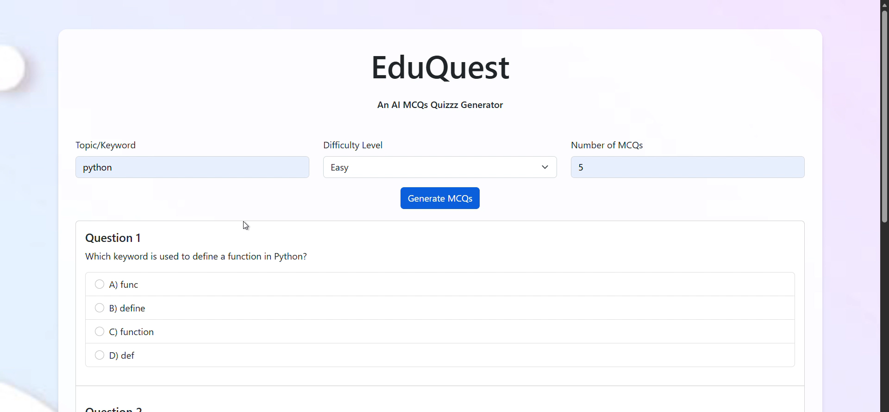
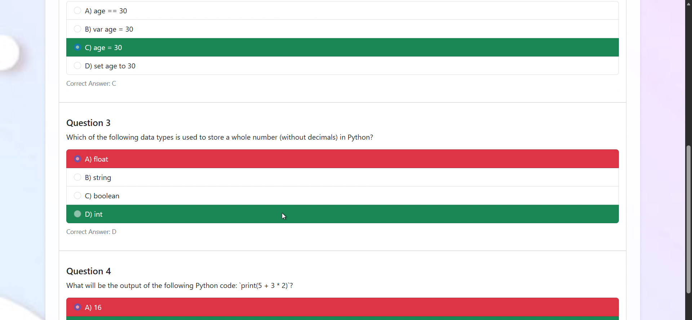

# 🎓 EduQuest: AI-Powered MCQ Generator

> A dynamic educational assessment tool that leverages **Google's Generative AI (Gemini)** to instantly create customized multiple-choice quizzes with explanations.

---

## 📖 Project Overview
**EduQuest** is a web-based application designed to address the challenge of creating high-quality educational assessments. Unlike traditional static question banks, EduQuest utilizes Artificial Intelligence to generate unique, contextually relevant questions on demand.

It helps educators and students by automating the creation of multiple-choice questions (MCQs) across various subjects and difficulty levels, providing instant feedback and detailed explanations for deep learning.

---

## ✨ Key Features
* **🤖 AI-Driven Generation:** Utilizes Google's **Gemini-2.5-flash** model to generate educationally sound questions.
* **🎚️ Adaptive Difficulty:** Offers 4 distinct levels: *Easy, Moderate, Challenging,* and *Hard*.
* **⚡ Instant Feedback:** Provides immediate scoring and highlights correct/incorrect answers.
* **📚 Explanations:** Automatically generates detailed explanations for answers (especially for non-easy levels) to reinforce learning concepts.
* **🎯 Topic Specific:** Generates quizzes based on any user-provided keyword or topic.

---

## 🛠️ Tech Stack
* **Backend:** Python (Flask Framework)
* **AI Engine:** Google Generative AI (Gemini API)
* **Frontend:** HTML5, Bootstrap 5, JavaScript
* **Styling:** Custom CSS (Responsive Design)

---

## 📸 Screenshots

| **Quiz Generation Interface** | **Scoring & Results** |
| :---: | :---: |
|  |  |

---

## 📂 Project Structure
```text
EduQuest/
│
├── static/
│   └── script.js          # Frontend logic for scoring & API calls
├── templates/
│   └── index.html         # Main user interface
├── screenshots/           # Images for README
│   ├── quiz_generation.png
│   └── results.png
├── app.py                 # Flask backend & Gemini integration
├── requirements.txt       # Project dependencies
├── .env                   # Template for API key
└── README.md              # Documentation
```

## ⚙️ Installation & Setup Guide
### 1. Clone the Repository
```bash
git clone https://github.com/keshavkalani15/EduQuest-AI-Quiz-Generator.git
cd EduQuest-AI-Quiz-Generator
```

### 2. Install Dependencies
Ensure you have Python installed, then run:
```bash
pip install -r requirements.txt
```

### 3. Configure API Key
This project requires a Google Gemini API Key.
* Get your key from Google AI Studio.
* Create a file named .env in the main folder.
* Add your key inside it like this:

```Code snippet
GOOGLE_API_KEY='your_actual_api_key_here'
```

### 4. Run the Application
```bash
python app.py
```
* The application will start at http://127.0.0.1:5000/

## 🧠 How It Works
* Input: User inputs a topic (e.g., "Python") and selects difficulty (e.g., "Easy").

* Prompting: The app sends a strict prompt to Google's Gemini AI, asking for a JSON-like structured response.

* Parsing: The backend extracts questions, options, and answers using Regex to ensure clean formatting.

* Interaction: The frontend renders the quiz; JavaScript handles the "Submit" logic to calculate scores instantly without reloading the page.

## 📜 License
This project was developed for educational purposes as a PBL project.
